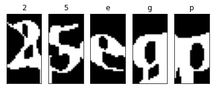
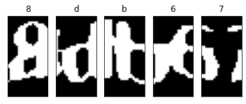

## Overview
The Captcha Image Dataset is Downloaded From [Kaggle](https://www.kaggle.com/fournierp/captcha-version-2-images)

## Objective
The Dataset Contains 1070 CAPTCHA 200 x 50 Images with 5 Letter Words Including Numbers.
The Objective of this Project is to Build and Train a CNN Model to Recgonize Characters in CAPTCHA Images.

## Goal
* Build and Train a CNN Model with > 95% Accuracy ❌ (Currently 91%)

## Learning Outcome

* Learn How to Preprocess Image Data with OpenCV ✔️
* Data Preprocessing - Build Training and Testing Set from Images ✔️
* Feature Engineering - Encode Labels (LabelEncoder, OneHotEncoder) ✔️
* Custom Build CNN Model ✔️
* Tensorboard Basics ✔️

## Evulation

* Learn How to Tweak a CNN Model Since I Don't Know what Layers to Use While Building the Model
  * I Referred to Examples in [Chapter 14](../../Hands-On%20Machine%20Learning/14_Deep_Computer_Vision_Using_Convolutional_Neural_Networks.ipynb) in Hands on Machine Learning while Building the Model
* Research Different Normalization Methods and Improve the Model (E.g., Dropout, Batch Normalization)
* Perform Exploratory Data Analysis on the Dataset
* In Image Preprocessing Stage, Individual Characters are Splitted with Fixed Points which Some Characters are Not Splitted Correctly, See Images Below. This Method Only Work For Some Images
  * This Severely Affects Accuracy of the Model

 

